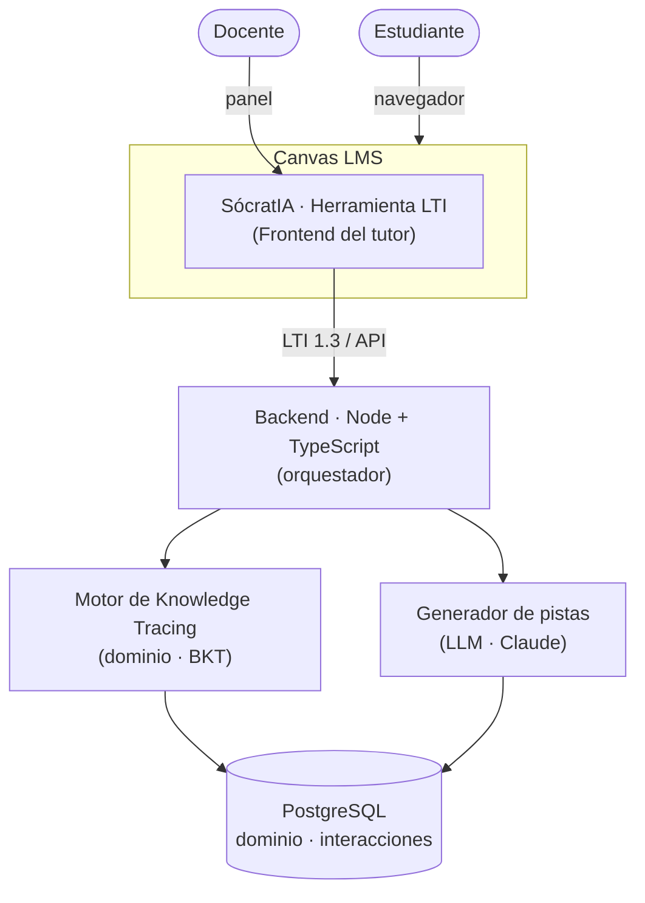
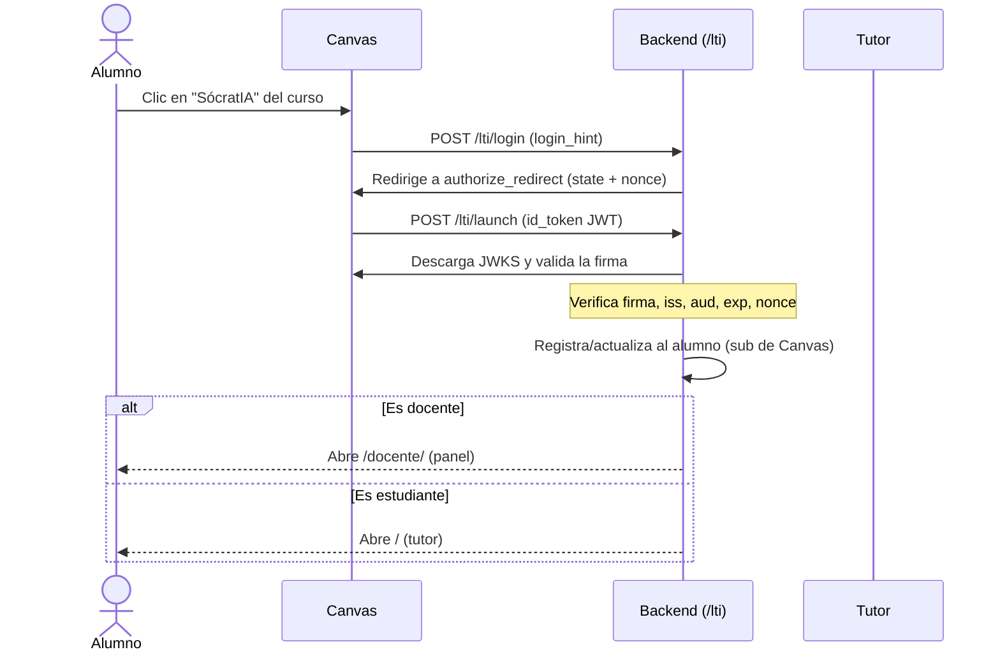
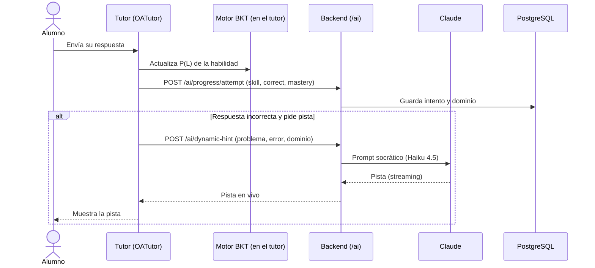
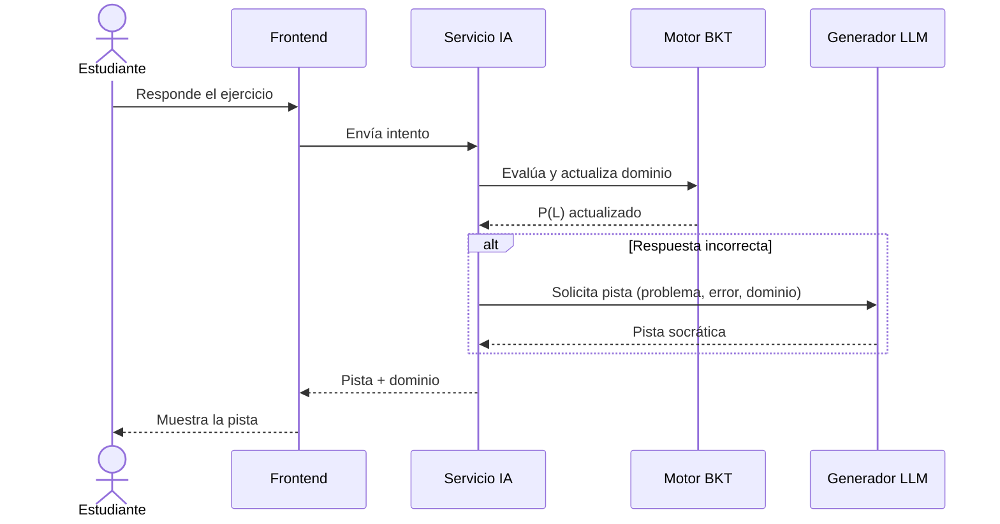
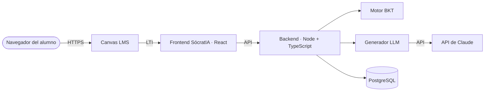
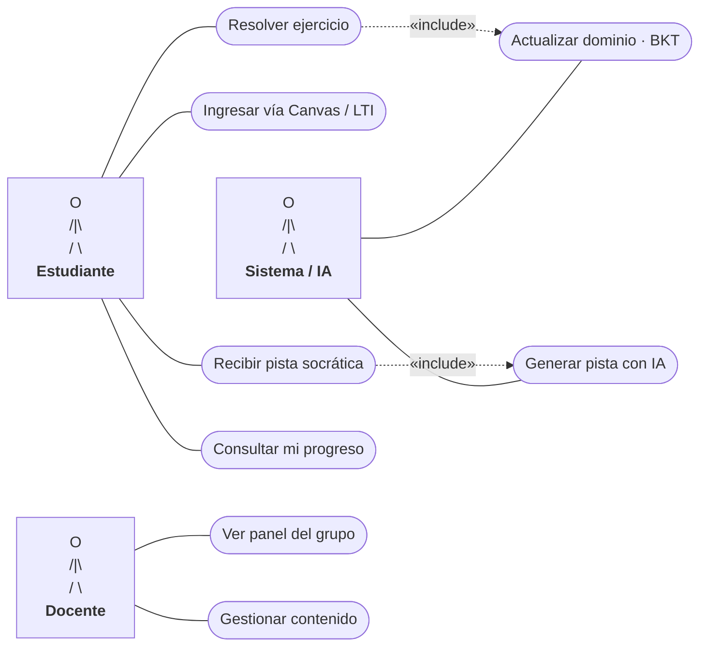

# SócratIA

### Sistema de Tutoría Inteligente Adaptativa con IA, integrado a Canvas LMS

> Un tutor inteligente que, mediante *knowledge tracing*, estima en vivo el dominio del estudiante y le entrega pistas socráticas personalizadas generadas por IA, todo embebido dentro de Canvas LMS y con un panel de seguimiento para el docente.

> Los diagramas de este documento usan **Mermaid**: GitHub los renderiza automáticamente como gráficos interactivos.

---

## Índice

1. [Introducción](#1-introducción)
2. [Descripción del sistema](#2-descripción-del-sistema)
3. [Objetivos](#3-objetivos)
4. [Marco conceptual (temas)](#4-marco-conceptual-temas)
5. [Arquitectura del sistema](#5-arquitectura-del-sistema)
6. [Métodos](#6-métodos)
7. [Diagramas](#7-diagramas)
8. [Casos de uso](#8-casos-de-uso)
9. [Características principales](#9-características-principales)
10. [Stack tecnológico](#10-stack-tecnológico)
11. [Estructura del proyecto](#11-estructura-del-proyecto)
12. [Roadmap](#12-roadmap)
13. [Conclusiones](#13-conclusiones)
14. [Referencias](#14-referencias)
15. [Contexto académico](#15-contexto-académico)
16. [Licencia](#16-licencia)

---

## 1. Introducción

La educación en línea creció de la mano de los **LMS** (Learning Management Systems) como Canvas, Moodle o Blackboard, que permiten administrar cursos, contenidos y calificaciones a gran escala. Sin embargo, estos sistemas son esencialmente **gestores de contenido**: entregan materiales y evalúan, pero **no acompañan** al estudiante cuando se equivoca ni adaptan la ayuda a su nivel real. El resultado es una enseñanza masiva pero impersonal, donde el alumno que no entiende un tema suele quedarse sin apoyo inmediato.

**SócratIA** nace para cerrar esa brecha. Es una herramienta de **tutoría inteligente adaptativa** que se integra a **Canvas LMS** mediante el estándar **LTI** y añade dos capacidades de inteligencia artificial que un LMS tradicional no tiene: **(1)** estima en tiempo real el **dominio** del estudiante por habilidad mediante *knowledge tracing*, y **(2)** genera **pistas socráticas personalizadas** con un modelo de lenguaje (LLM), que guían sin revelar la respuesta.

El nombre une a *Sócrates* —cuyo método consiste en enseñar guiando con preguntas y pistas progresivas— con la **IA**, porque ese es exactamente el principio del sistema.

Este documento define la **arquitectura, los métodos, los diagramas y los casos de uso** que guiarán el desarrollo de SócratIA.

---

## 2. Descripción del sistema

SócratIA es una **herramienta LTI** que se embebe dentro de un curso de Canvas. El estudiante resuelve ejercicios sin salir de la plataforma; cada intento alimenta un **motor de modelado del conocimiento** que actualiza su nivel de dominio, y cuando comete un error, un **generador de pistas con IA** le entrega ayuda socrática adaptada a ese error y a su nivel. El docente dispone de un **panel** con el progreso del grupo y alertas tempranas.

A diferencia de un LMS tradicional —que solo entrega y califica—, SócratIA **modela el conocimiento de cada estudiante** y **personaliza la ayuda**, acercando la atención individual a un entorno de enseñanza masiva.

El proyecto se construye sobre **OATutor** (UC Berkeley), un sistema tutor inteligente *open source* que ya aporta el motor de *Bayesian Knowledge Tracing* y un banco de contenido con pistas estructuradas; SócratIA lo **extiende** reemplazando las pistas estáticas por pistas generadas dinámicamente con un LLM y conectándolo a Canvas.

---

## 3. Objetivos

**Objetivo general**
- Desarrollar un sistema de tutoría inteligente adaptativa, integrado a Canvas LMS, que personalice el acompañamiento del estudiante mediante técnicas de inteligencia artificial.

**Objetivos específicos**
- Integrar la herramienta a Canvas LMS mediante el estándar LTI.
- Estimar el nivel de dominio del estudiante por habilidad usando *knowledge tracing*.
- Generar pistas y retroalimentación socrática personalizada con un modelo de lenguaje (LLM).
- Proveer al docente un panel con el progreso y los puntos críticos del grupo.

---

## 4. Marco conceptual (temas)

**4.1 CMS y LMS.** Un *Content Management System* (CMS) administra y publica contenido digital sin programar desde cero (WordPress, Drupal). Un **LMS es un CMS especializado en educación**: gestiona cursos, estudiantes, evaluaciones y calificaciones.

**4.2 Canvas LMS.** LMS *open source* de Instructure (backend en Ruby on Rails, frontend en React). No se modifica su núcleo: se **extiende** mediante LTI y su API REST/GraphQL.

**4.3 LTI (Learning Tools Interoperability).** Estándar de 1EdTech que permite **incrustar herramientas externas** dentro de un LMS de forma segura, con paso de identidad del usuario y contexto del curso. Es el "enchufe" que conecta SócratIA con Canvas.

**4.4 Knowledge Tracing (KT).** Técnica que modela la probabilidad de que un estudiante **domine una habilidad** a partir de su historial de respuestas. SócratIA usa **Bayesian Knowledge Tracing (BKT)**, que funciona en vivo y sin entrenamiento previo (ver [§6.1](#6-métodos)).

**4.5 Sistemas Tutores Inteligentes (ITS) y método socrático.** Un ITS guía al estudiante paso a paso con **andamiaje** (pistas progresivas) en lugar de dar la respuesta, replicando el **método socrático**.

**4.6 Modelos de lenguaje (LLM) en educación.** Los LLM permiten generar pistas y retroalimentación en lenguaje natural, **personalizadas** al error y al nivel del estudiante, superando a las pistas fijas escritas a mano.

**4.7 OATutor.** Sistema tutor inteligente *open source* (React + BKT) con banco de contenido; es la **base tecnológica** sobre la que se construye SócratIA.

---

## 5. Arquitectura del sistema

### 5.1 Visión general



### 5.2 Componentes

| Componente | Responsabilidad |
|---|---|
| **Frontend del tutor** | Interfaz embebida en Canvas donde el alumno resuelve ejercicios y recibe pistas (React). |
| **Servicio de IA** | Orquesta el flujo: recibe la respuesta, consulta el dominio y pide la pista (Node + TypeScript). |
| **Motor de Knowledge Tracing** | Estima y actualiza el dominio por habilidad (BKT). |
| **Generador de pistas (LLM)** | Produce la pista socrática personalizada (Claude). |
| **Panel docente** | Visualiza progreso y alertas del grupo. |
| **Base de datos** | Persiste interacciones, estado de dominio y contenido. |
| **Capa LTI** | Autenticación e intercambio de identidad/contexto con Canvas. |

### 5.3 Tecnologías

Ver el detalle por capa en [§10. Stack tecnológico](#10-stack-tecnológico).

### 5.4 Funcionamiento paso a paso (sistema real desplegado)

Esta sección describe **cómo funciona el sistema ya construido**, con sus componentes, dominios y endpoints reales.

#### 5.4.1 Topología desplegada

Todo corre en un servidor Linux detrás de **nginx**, con Cloudflare aportando el HTTPS público.

| Pieza | Dónde corre | Servicio (systemd) | Función |
|---|---|---|---|
| **Tutor (OATutor)** | `cms.net.pe` (estático en nginx) | — | Interfaz donde el alumno resuelve y recibe pistas |
| **Panel docente** | `cms.net.pe/docente/` (estático) | — | Tablero de progreso del grupo |
| **Backend** | `127.0.0.1:8001` (Node) | `socrateai` | IA, progreso y LTI; nginx lo expone en `/ai/` y `/lti/` |
| **Canvas LMS** | `127.0.0.1:3010` (Docker) | `canvas` | LMS que lanza la herramienta vía LTI |
| **PostgreSQL** | local | — | Alumnos, intentos y dominio por habilidad |

nginx enruta así en `cms.net.pe`: `/ai/` y `/lti/` → backend; `/docente/` → panel; todo lo demás → el tutor. El subdominio `canvas.cms.net.pe` proxea a Canvas.

#### 5.4.2 Paso a paso — el alumno entra desde Canvas (LTI 1.3)



1. El alumno hace clic en **SócratIA** en la navegación del curso de Canvas.
2. Canvas inicia el **OIDC login**: `POST /lti/login`. El backend genera `state` y `nonce` y **redirige** al `authorize_redirect` de Canvas.
3. Canvas responde con el **launch**: `POST /lti/launch` enviando un **`id_token` (JWT)** firmado.
4. El backend descarga el **JWKS** de Canvas y **valida** el token: firma, `issuer`, `audience` (nuestro `client_id`), expiración y `nonce`.
5. Con el `sub` del token (identidad real del usuario en Canvas) se **registra/actualiza el alumno** en PostgreSQL.
6. Según el **rol**: si es docente abre el **panel** (`/docente/`); si es estudiante abre el **tutor** (`/`). Todo dentro del iframe de Canvas.

#### 5.4.3 Paso a paso — el alumno resuelve un ejercicio y recibe una pista



1. El alumno responde un paso del ejercicio en el tutor.
2. El **motor BKT** (incrustado en OATutor) actualiza la probabilidad de dominio **P(L)** de cada habilidad del paso.
3. El tutor envía el intento a `POST /ai/progress/attempt` con la habilidad, si fue correcto y el **dominio actualizado**; el backend lo **persiste** en PostgreSQL ligado al id del alumno (de Canvas o, fuera de Canvas, uno anónimo en `localStorage`).
4. Si falló y pide ayuda, el tutor llama a `POST /ai/dynamic-hint` con el enunciado, su error, su dominio y las pistas previas.
5. El backend arma el **prompt socrático** y consulta **Claude Haiku 4.5**, devolviendo la pista en **streaming** (sin revelar la respuesta, adaptada al nivel).
6. El tutor muestra la pista en vivo a medida que se genera.

#### 5.4.4 Paso a paso — el docente ve el progreso

1. El docente abre el **panel** (`/docente/`), directo o lanzado desde Canvas.
2. El panel consulta `GET /ai/students`: lista de alumnos con intentos, aciertos y **dominio promedio**.
3. Al hacer clic en un alumno, consulta `GET /ai/progress/{id}`: **dominio por habilidad** y actividad reciente (aciertos/fallos).
4. Así el docente identifica los **puntos críticos** del grupo y quién está en riesgo.

#### 5.4.5 Arranque automático

Los servicios `docker`, `canvas`, `socrateai` y `nginx` están habilitados en systemd; tras reiniciar el servidor, el sistema completo se levanta solo y en orden. Config versionada en [`deploy/`](./deploy).

---

## 6. Métodos

### 6.1 Método de modelado del conocimiento — Bayesian Knowledge Tracing (BKT)

BKT (Corbett & Anderson, 1994) modela el dominio de cada **habilidad** con cuatro parámetros:

| Parámetro | Significado |
|---|---|
| **P(L0)** | Probabilidad de que el alumno ya domine la habilidad antes de practicar (conocimiento inicial). |
| **P(T)** | Probabilidad de **aprender** la habilidad en cada oportunidad (transición). |
| **P(S)** | *Slip*: probabilidad de fallar **a pesar de** dominar la habilidad. |
| **P(G)** | *Guess*: probabilidad de acertar **sin** dominar la habilidad (adivinar). |

Tras cada respuesta se actualiza P(L) (probabilidad de dominio) en dos pasos:

**1) Condicionar según la evidencia (acierto/error):**
```
Si acertó:
P(L | correcto)   =  [ P(L)·(1-S) ]  /  [ P(L)·(1-S) + (1-P(L))·G ]

Si falló:
P(L | incorrecto) =  [ P(L)·S ]      /  [ P(L)·S     + (1-P(L))·(1-G) ]
```

**2) Aplicar el aprendizaje (transición):**
```
P(L)_nuevo = P(L | evidencia) + (1 - P(L | evidencia)) · T
```

Los parámetros por habilidad viven en `content-pool/.../bkt-params` (heredados de OATutor). Ventaja: **no requiere entrenar** con un dataset previo.

### 6.2 Método de generación de pistas socráticas (LLM)

Cuando el alumno se equivoca, el generador construye un *prompt* con:
- el **enunciado** del problema y el **paso** actual,
- la **respuesta correcta** (oculta al alumno),
- la **respuesta del alumno** (su error concreto),
- su **dominio actual** P(L) de la habilidad,
- las **pistas ya entregadas** (para no repetir).

Reglas del *prompt* (método socrático):
1. **Nunca** revelar la respuesta final.
2. Entregar **una sola** pista/pregunta guía a la vez.
3. Ajustar la profundidad al dominio: dominio **alto** → pista sutil; dominio **bajo** → más andamiaje.
4. Partir del **error específico** del alumno, no de una pista genérica.

Modelo: **Claude (Anthropic)**. Para pistas en tiempo real conviene priorizar **baja latencia** (p. ej. Claude Haiku 4.5) y, donde se requiera mayor calidad de razonamiento, un modelo superior (Claude Sonnet 4.6 / Opus 4.8).

### 6.3 Método de aprendizaje adaptativo

A partir del dominio estimado se decide el **siguiente paso**: repetir andamiaje si P(L) es bajo, o avanzar al siguiente ejercicio/habilidad cuando P(L) supera un umbral de maestría.

### 6.4 Metodología de desarrollo

Desarrollo **iterativo e incremental** con **Scrum**: el producto se construye en *sprints*, priorizando primero la integración LTI y el motor BKT, y luego el generador de pistas y el panel docente.

---

## 7. Diagramas

### 7.1 Diagrama de arquitectura
Ver [§5.1](#51-visión-general).

### 7.2 Diagrama de secuencia (resolver un paso y recibir pista)



### 7.3 Diagrama de despliegue



---

## 8. Casos de uso

### 8.1 Actores
- **Estudiante:** resuelve ejercicios y recibe tutoría.
- **Docente:** supervisa el progreso y gestiona el contenido.
- **Sistema/IA:** actualiza el dominio y genera las pistas (actor de sistema).

### 8.2 Diagrama de casos de uso



> Nota: los actores se representan con la figura clásica de UML (monigote). El "Sistema / IA" es un **actor de sistema** que ejecuta la actualización del dominio y la generación de pistas.

### 8.3 Especificación de casos de uso (principales)

**CU-02 — Resolver ejercicio**
| Campo | Detalle |
|---|---|
| Actor | Estudiante |
| Precondición | Estar autenticado en Canvas y haber abierto la actividad de SócratIA. |
| Flujo principal | 1) El alumno lee el ejercicio. 2) Ingresa su respuesta. 3) El sistema la evalúa. 4) Registra la interacción y actualiza el dominio (CU-04). 5) Si acierta, avanza; si falla, dispara CU-03. |
| Postcondición | Interacción registrada y dominio actualizado. |

**CU-03 — Solicitar/recibir pista socrática**
| Campo | Detalle |
|---|---|
| Actor | Estudiante / Sistema-IA |
| Precondición | El alumno cometió un error o pidió ayuda. |
| Flujo principal | 1) El servicio reúne problema, paso, respuesta del alumno, dominio y pistas previas. 2) El generador LLM produce una pista socrática. 3) Se muestra al alumno (sin revelar la respuesta). |
| Postcondición | El alumno recibe una pista adaptada a su error y nivel. |

**CU-05 — Ver panel de progreso**
| Campo | Detalle |
|---|---|
| Actor | Docente |
| Precondición | Tener rol docente en el curso de Canvas. |
| Flujo principal | 1) Abre el panel. 2) Visualiza el dominio por estudiante y por tema. 3) Recibe alertas de quienes están en riesgo. |
| Postcondición | El docente identifica los puntos críticos del grupo. |

---

## 9. Características principales

- **Integración nativa con Canvas** mediante LTI: el tutor aparece embebido en el curso.
- **Modelado del dominio en vivo (Knowledge Tracing).**
- **Tutoría socrática con IA generativa**, adaptada al error y al nivel.
- **Aprendizaje adaptativo** según el dominio estimado.
- **Panel docente** con alertas tempranas.
- **Transparencia y privacidad** sobre los datos que usa la IA.

---

## 10. Stack tecnológico

| Capa | Tecnología |
|---|---|
| **LMS base** | Canvas LMS (open source / Canvas Free for Teacher) |
| **Integración** | LTI 1.3 (Advantage) + API REST/GraphQL de Canvas |
| **Frontend del tutor** | React (base OATutor) |
| **Backend (IA + progreso)** | Node + TypeScript (Fastify), tipado estricto |
| **Knowledge Tracing** | BKT (base OATutor); opcional pyKT / EduKTM |
| **LLM (pistas socráticas)** | Claude Haiku 4.5 (Anthropic) |
| **Panel docente** | HTML + JS (servido por nginx en `/docente`) |
| **Base de datos** | PostgreSQL |

---

## 11. Estructura del proyecto

```
SocratIA/
├── OATutor/           Base del tutor inteligente (React + BKT + contenido)
├── backend/           Backend Node + TypeScript: pistas con LLM y progreso (PostgreSQL)
│   └── src/           config · types · parse · repository · tutor · routes · server
├── dashboard/         Panel del docente (HTML/JS), servido en /docente
├── lti-tool/          Integración LTI con Canvas
├── README.md          Documento de diseño (este archivo)
```

---

## 12. Roadmap

- [x] Ejecutar OATutor como base del tutor.
- [x] Implementar el backend que genera pistas socráticas con un LLM (Claude Haiku 4.5).
- [x] Conectar las pistas dinámicas dentro del flujo del tutor.
- [x] Registrar el progreso del alumno (intentos y dominio) en PostgreSQL.
- [x] Desarrollar el panel docente.
- [x] Levantar Canvas en Docker y registrar la herramienta LTI 1.3.
- [x] Integrar el tutor a Canvas vía LTI (login OIDC, launch con validación de JWT, ruteo por rol).
- [ ] Pruebas con un curso piloto.

---

## 13. Conclusiones

- SócratIA demuestra que un **LMS** (Canvas) puede pasar de ser un simple gestor de contenidos a un **entorno de tutoría personalizada**, sin reescribir su núcleo, gracias al estándar **LTI**.
- La combinación de **Knowledge Tracing** (que mide el dominio en vivo) con un **LLM** (que genera pistas socráticas) constituye el **aporte de inteligencia artificial** del proyecto y lo diferencia de un tutor con pistas fijas.
- Apoyarse en **OATutor** como base reduce el riesgo y el tiempo de desarrollo, permitiendo concentrar el esfuerzo en el valor agregado: la **personalización de la ayuda**.
- El diseño es **viable** para el alcance académico: la base ya funciona y los componentes de IA están claramente acotados.
- **Trabajo futuro:** evaluación del impacto en el aprendizaje con un curso piloto, soporte multi-materia y mejora del modelo de dominio con *Deep Knowledge Tracing*.

---

## 14. Referencias

- **Canvas LMS** — plataforma base. https://github.com/instructure/canvas-lms
- **IgniteAI (Instructure)** — capa oficial de IA de Canvas. https://www.instructure.com/press-release/instructure-launches-igniteai-simplify-and-seamlessly-transform-ai-integration
- **OATutor (UC Berkeley)** — tutor inteligente *open source* con BKT. https://github.com/CAHLR/OATutor
- **EduKTM / pyKT (USTC, China)** — librerías de *knowledge tracing*. https://github.com/bigdata-ustc/EduKTM
- **Corbett & Anderson (1994)** — *Knowledge Tracing: Modeling the Acquisition of Procedural Knowledge*. Fundamento del BKT.
- **LTI (1EdTech)** — estándar de interoperabilidad de herramientas de aprendizaje. https://www.1edtech.org/standards/lti

---

## 15. Contexto académico

- **Curso:** Sistemas de Gestión de Contenidos (CMS) / Sistemas de Gestión del Aprendizaje (LMS).
- **Tipo:** proyecto académico.
- **Equipo:** _por completar_.

---

## 16. Licencia

Por definir.
